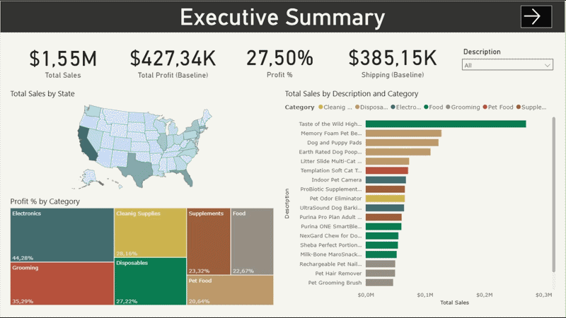

# 🐶Ecommerce Analysis

> **Stakeholder:** Whiskique Management Team (DataCamp).        
> **Objective:** Drive sales growth through upselling/cross-selling and reduce operational expenses by optimizing "last-mile" shipping costs.

## Project Overview
In this role as a Data Analyst for **Whiskique**, an online pet supply retailer, I transformed raw e-commerce data into a strategic tool for decision-making. The project focuses on the delicate balance between high-volume sales and the underlying costs of the supply chain—specifically COGS, freight, and last-mile delivery.

## Strategic Report Walkthrough


## Motivation & Problem Statement
Whiskique faces the classic e-commerce challenge: growing the customer base while protecting profit margins from rising fulfillment costs.
  * **The Challenge:** Shipping costs (averaging $5 per unit in our canned food model) significantly eat into the $8 profit margin.
  * **The Goal:** Build an interactive Power BI suite to:
      * Identify **Upsell** (higher-priced alternatives) and **Cross-sell** (relevant add-ons) opportunities.
      * Perform **What-If Analysis** to visualize how increasing shipping quantities per order impacts the bottom line.
      * Map the relationship between Product, Customer, and State data to find regional efficiency gaps.

## Technology & Process
  * **Tools:** Power BI (Power Query, DAX, Data Modeling)
  * **Data Architecture:** Developed a relational model using four CSV sources (**Sales, Product, Customer, and State Mapping**) connected via a Star Schema.
  * **The Process:**
    1.  **Supply Chain Modeling:** Integrated cost structures (COGS, Freight, Fulfillment, and Shipping) into the data model to calculate true profit.
    2.  **What-If Parameters:** Created a dynamic "Average Shipped Quantity" parameter to simulate cost savings across the business.
    3.  **Market Basket Insights:** Analyzed product correlations to identify which items are frequently bought together to inform marketing strategies.
    4.  **UI/UX:** Focused on "Dashboard-style" pages using high-contrast KPIs for Sales and Shipping Savings to ensure immediate clarity for management.

## Quantified Business Impact
  * **Shipping Cost Optimization:** The What-If analysis shows that increasing average shipped quantity to 11 units reduces total shipping costs from $385.15K to $266.96K — a **savings of $118.19K (≈30.7% reduction)**. Applied against the current baseline profit of $427.34K, this represents a potential **~27.6% profit uplift** without any change in sales volume.
  * **Margin Gap by Category:** Electronics carries the highest profit margin (44.28%), while Pet Food — despite driving the highest sales volume — has the lowest margin (20.64%). This highlights a clear upsell opportunity: shifting purchase behavior toward higher-margin categories or bundling Pet Food with higher-margin add-ons would improve overall profitability.
  * **Cross-sell Opportunity:** Market basket analysis identified consistent purchase pairs (e.g. Dog and Puppy Pads with Earth Rated Dog Poop Bags), providing concrete, data-driven bundle recommendations for the marketing team.


## Key Insights (Business Questions Answered)
  * **Shipping Optimization:** Demonstrated that consolidating shipments or increasing the units-per-package directly reduces "last-mile" expenses, significantly increasing the net profit per transaction.
  * **Growth Levers:** Identified specific organic pet food lines that serve as high-value "Upsell" targets for customers currently buying standard recurring items.
  * **Inventory Correlation:** Highlighted product pairs that are regularly purchased together, providing a roadmap for point-of-purchase cross-sell offers.
  * **Financial Transparency:** Provided a clear view of the "Landed Cost" vs. "Retail Price," allowing management to see exactly where margins are being eroded.

## Challenges & Limitations
  * **Market Basket Complexity:** While high-frequency pairs were identified, full correlation coefficient analysis was out of scope due to the need for advanced nested DAX formulas.
  * **Fictitious Constraints:** As the data is synthetic, external market factors (competitor pricing, fuel surcharges) were not factored into the shipping cost model.

## Repository Structure
```
* /Datasets : Four CSV files.
* /Media: A video walkthrough of the strategic report.
* /Theme: The theme of the strategic report.
* Ecommerce-Analysis.pbix: The final Power BI strategic report.
```
