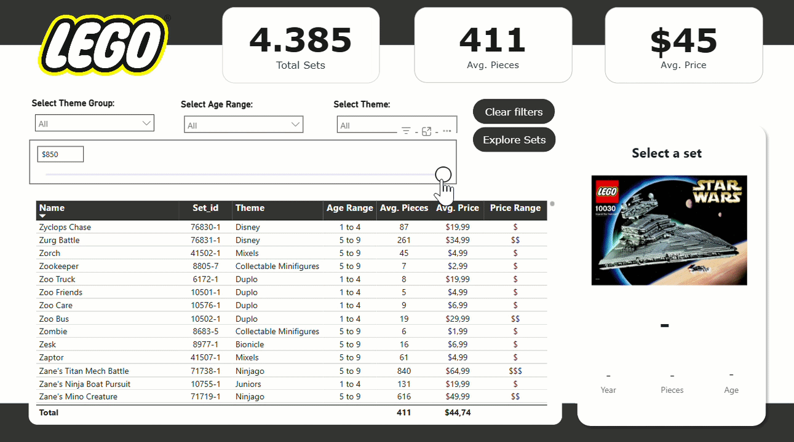
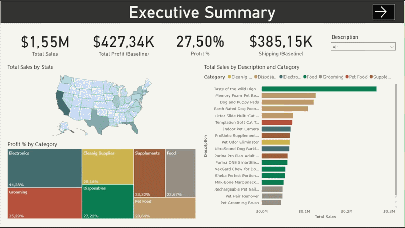

#   PowerBI Projects
My PowerBI Projects from Datacamp, Maven Analytics

## 1. LEGO Set Explorer  

In this project, I built a comprehensive Power BI report to explore a dataset of LEGO sets. The analysis focuses on providing a user-friendly interface to navigate thousands of products, filtering by theme groups, age ranges, and price points to help collectors or analysts identify specific market segments

---
## 2. Case Study: Analyzing Healthcare Data

In this case study, I acted as a consultant for HealthStat to uncover insights into hospital operational efficiency. The analysis focuses on New York State-wide hospital discharge data, specifically targeting patients who underwent elective hip replacement surgery

---
## 3. Case Study: Ecommerce Analysis

In this role as a Data Analyst for Whiskique, an online pet supply retailer, I transformed raw e-commerce data into a strategic tool for decision-making. The project focuses on the delicate balance between high-volume sales and the underlying costs of the supply chain—specifically COGS, freight, and last-mile delivery.

---
## 4. Case Study: Mortgage Trading Analysis

In this advanced case study, I acted as a Junior Trader for a mortgage originator. The project simulates the lifecycle of a mortgage within the broader financial system—from lending to borrowers to selling those loan agreements to large investment banks. I was responsible for data modeling the loan population, calculating the current principal via amortization, and executing a trade that balances firm profitability with market competitiveness.

---
## 5. Case Study: Inventory Analysis

In this role as a Strategic Consultant for WarmeHands Inc., I conducted a deep-dive inventory audit to solve a classic business problem: Which items are worth the investment for restocking? Using a fictitious dataset of 104 items across five categories, I moved from basic profit metrics to advanced efficiency ratios and classification models to provide data-driven purchasing recommendations.

---
